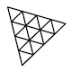

  

GLTF Timeline Markers extension
===============================

Custom extension to support animation timeline markers with camera binding support in glTF. Adjusted for internal use at Winning Streak Games GmbH.

Installation
------------

### [Download WSG_animation_markers.py](./WSG_animation_markers.py)

Install the addon in Blender by choosing: *Preferences → Add-ons → Install...*
